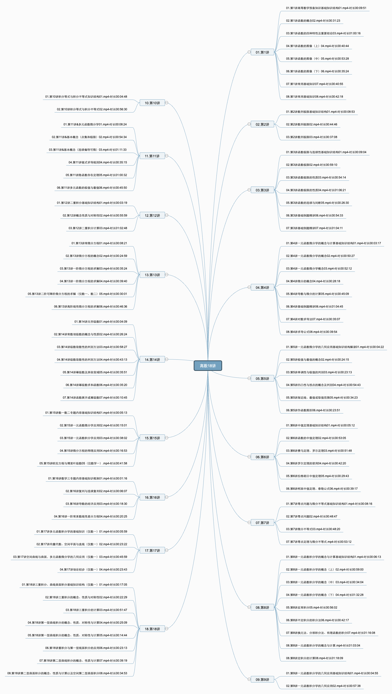

# xmind_videoDuration
It is used to display the name and duration of the video file in all the root directories in the current directory.
## How should I use this?
### step1.Enter the following instructions
```
npm i
```
### step2.Modify the folder path you want to use.
```
const dir_path = "/Users/akko/Downloads/01.高数"; //In the ninth line of the code
```
### step3.Set the theme of xmind
```
start("xxx") //In the last line of the code
```
### step4.Run
```
node app.js
```
## Preview

